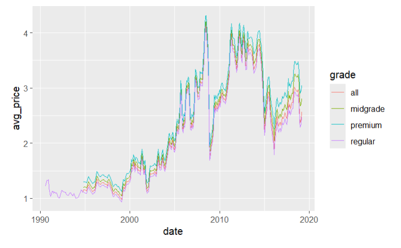

## Summary

Looking at the data set "Weekly US Gas Prices" from `tidytuesday` which was obtained from the U.S. Energy Information Administration(EIA). My objective was to check if the price of Gasoline would follow a positive linear relationship or if global financial events would cause enough noise to disrupt this linear relation.



`Figure 1` shows the average price across all grades: regular, midgrade, premium and all(a weighted average of the other grades) from August 20, 1990 to June 23, 2025. Each different color representing a different grade. From this graph we can see a clear positive linear relationship between the price and time, but there are additionally very clear spikes/dips in the price cause my global financial events, which will be explored here.


## Motivation and Context

```{r}
#| label: do this first
#| echo: false
#| message: false

here::i_am("project.qmd")
```


## Packages Used In This Analysis

```{r}
#| label: load packages
#| message: false
#| warning: false

library(here)
library(dplyr)
library(rsample) 
library(ggplot2)        
library(lubridate)      
library(forcats)        
library(tidyr)          
library(tidytuesdayR)      
library(recipes)        
library(parsnip)        
library(workflows)      
library(tune)           
library(yardstick)    

```


| Package | Use |
|-------------------------------|----------------------------------------|
| [here](https://github.com/jennybc/here_here) | to easily load and save data |
| [dplyr](https://dplyr.tidyverse.org/) | to massage and summarize data |
| [rsample](https://rsample.tidymodels.org/) | to split data into training and test sets |
| [ggplot2](https://ggplot2.tidyverse.org/) | to create nice-looking and informative graphs |
| [lubridate](https://lubridate.tidyverse.org/) | to extract and manipulate date information |
| [forcats](https://forcats.tidyverse.org/) | to reorder factors by specified values |
| [tidyr](https://tidyr.tidyverse.org/) | to reshape summary tables for easier comparison |
| [resample](https://rsample.tidymodels.org/) | to create resamples for sake of modeling |
| [recipes](https://recipes.tidymodels.org/) | to build preprocessing steps prior to modeling |
| [parsnip](https://parsnip.tidymodels.org/) | to provide a tidy, unified interface to try multiple models |
| [workflows](https://workflows.tidymodels.org/) | to combine recipes and models into complete and resuable workflows |
| [tune](https://tune.tidymodels.org/) | to facilitate hyperparameter tuning |
| [yardstick](https://yardstick.tidymodels.org/) | to estimate how well models are working |

## Data Description

I am using the data set "Weekly US Gas Prices" from `tidytuesday`. This data was taken from the U.S. Energy Information Administration(EIA) which publishes retail gasoline and diesel prices each Monday. An individual named Jon Harmon, took the data from the website to be used for analysis.

Each observation corresponds to the price of fuel on each Monday from August 20, 1990 to June 23, 2025. With repeated dates showing differing prices(USD per gallon) based on fuel type(gasoline or diesel), grade(all, regular, midgrade, premium, low and ultra low sulfur) and formulation(all, conventional, and reformulated) The data itself is collected from a sample of 1,000 retail gasoline outlets across the U.S. which are then weighted and an average is taken to represent the gas price for that Monday.

```{r}
#| label: import data
#| warning: false
tuesdata <- tidytuesdayR::tt_load(2025, week = 26)
weekly_gas_prices <- tuesdata$weekly_gas_prices
```

## Data Wrangling (Optional Section)

```{r}
#| label: split the data

diesel_prices <- weekly_gas_prices %>% filter(is.na(formulation)) %>% dplyr::select(date, fuel, grade, price)
gas_prices <- weekly_gas_prices %>% filter(!is.na(formulation))

gas_prices_split <- initial_time_split(gas_prices, prop = 0.8)
gas_prices_train <- training(gas_prices_split)
gas_prices_test <- testing(gas_prices_split)

```
For the sake of prediction, I want to create training and test splits of the data. Firstly, I divide the data based on diesel and gas, since I want to focus strictly on gas prices.

Since the gas price data has roughly 20,000 observations I am using `prop = 0.8` to give the training set 15,737 obs. and the test set 3935 obs. at an 80/20 split. I use specifically `initial_time_split` such that the test set is filled purely of the "future" data. This way I can predict future prices based on past prices.


## Exploratory Data Analysis

We begin by examining the univariate distributions of gas price and fuel grade, followed by bivariate relationships between price, grade, and time.

### Univariate Summaries

```{r}
#| label: univariate-summaries
#| message: false

# Summary statistics for price
gas_prices_train |> 
  summarise(
    n = n(),
    min_price = min(price),
    mean_price = mean(price),
    median_price = median(price),
    sd_price = sd(price),
    max_price = max(price)
  )

# Distribution of fuel grades
gas_prices_train |> 
  count(grade, sort = TRUE) |> 
  mutate(percent = n / sum(n) * 100)

```

The price variable shows a right-skewed distribution. Fuel grade is roughly balanced across regular, midgrade, premium, and all, though regular has a higher count because the EIA began publishing data with only the regular grade.

```{r}
#| label: univariate-plots
#| fig-cap: "Distribution of gas prices (top) and counts by fuel grade (bottom)"

ggplot(gas_prices_train, aes(x = price)) +
  geom_histogram(bins = 40, fill = "dodgerblue", color = "white") +
  labs(x = "Price (USD per gallon)", y = "Count")

ggplot(gas_prices_train, aes(x = fct_infreq(grade))) +
  geom_bar(fill = "darkorange") +
  labs(x = "Fuel Grade", y = "Number of Observations")


```
The histogram confirms right-skewness with noticeable peaks near 2.75 and 3.75. The bar chart reinforces that regular grade dominates early in the time series.

```{r}
#| label: price-by-grade
#| fig-cap: "Price distributions faceted by fuel grade"

ggplot(gas_prices_train, aes(x = price)) +
  geom_histogram(bins = 40, fill = "dodgerblue", color = "white") +
  facet_wrap(~ grade) +
  labs(x = "Price (USD per gallon)", y = "Count")
```
Price distributions follow similar right-skewed patterns across grades, though regular appears slightly more volatile.

```{r}
#| label: 2007-2015-detail
#| fig-cap: "Weekly gas prices during the 2007–2015 financial crisis period"

gas_prices_train |> 
  mutate(year = year(date)) |> 
  filter(year %in% 2007:2015) |> 
  ggplot(aes(x = date, y = price, color = grade)) +
  geom_line(alpha = 0.7) +
  facet_wrap(~ grade) +
  labs(x = "Date", y = "Price (USD per gallon)")
```

```{r}
#| label: yearly-averages-2007-2017
gas_prices_train |> 
  mutate(year = year(date)) |> 
  filter(year %in% 2007:2017) |> 
  group_by(year, grade) |> 
  summarise(avg_price = mean(price), .groups = "drop") |> 
  pivot_wider(names_from = grade, values_from = avg_price)
```

Average prices dropped approximately $0.90 per gallon from 2008 to 2009 and again from 2014 to 2015. These declines correspond to the 2008 Global Financial Crisis (triggered by the U.S. housing bubble collapse) and the 2014–2016 oil price crash, both of which had global effects on energy markets.

## Modeling

I selected ordinary least squares (OLS) linear regression as our primary supervised learning model to predict weekly U.S. retail gas prices. Linear regression is an excellent baseline for this time-series forecasting task because it is highly interpretable and captures the long-term upward trend and seasonal patterns observed in the EDA.

Mathematically, the model assumes a linear relationship between the response variable \( y \) (price in USD per gallon) and the predictors \( \mathbf{x} \):

\[
\hat{y} = \beta_0 + \beta_1 x_1 + \beta_2 x_2 + \cdots + \beta_p x_p
\]

The coefficients \( \boldsymbol{\beta} \) are estimated by minimizing the residual sum of squares (RSS):

\[
\hat{\boldsymbol{\beta}} = \arg\min_{\boldsymbol{\beta}} \sum_{i=1}^{n} (y_i - \hat{y}_i)^2
\]

This approach makes minimal assumptions beyond linearity and constant variance. While the EDA revealed clear economic shocks and right-skewness, the strong temporal trends make linear regression a reasonable and transparent starting point.

I first prepare the training data by extracting the year and month from the `date` variable (month is treated as a categorical factor for seasonality). I then build a preprocessing recipe that dummy-encodes all nominal predictors (`grade`, `formulation`, and `month`) and normalizes the remaining numeric predictor (`year`).

```{r}
#| label: prepare-data-recipe
#| message: false

updated_train <- gas_prices_train |>
  dplyr::mutate(
    year = year(date),
    month = month(date, label = TRUE)
  ) |>
  dplyr::select(price, grade, formulation, year, month)

gas_price_recipe <- recipe(
  price ~ .,
  data = updated_train
) |> 
  step_dummy(all_nominal_predictors()) |>
  step_normalize(all_numeric_predictors())
```

Because gas prices are a time series, I evaluate the model using rolling-origin cross-validation (a time-aware resampling method). This ensures that every assessment set consists only of data that occurs after the training data, mimicking real-world forecasting.

```{r}
#| label: rolling-origin-cv
#| message: false

set.seed(5)
gas_price_folds <- rolling_origin(
  data = updated_train,
  initial = 800,
  assess = 100,
  cumulative = FALSE,
  skip = 50
)
```

I specify a linear regression model using the *lm* engine and combine it with the recipe into a complete workflow. The model is then fit across all rolling-origin resamples and evaluated with root mean squared error (RMSE).

```{r}
#| label: linear-regression-workflow

lm_model <- linear_reg(
  mode = "regression",
  engine = "lm"
)

lm_wflow <- workflow() |>
  add_recipe(gas_price_recipe) |>
  add_model(lm_model)

lm_fit <- lm_wflow |>
  fit_resamples(
    resamples = gas_price_folds,
    metrics = metric_set(rmse)
  )
```

```{r}
#| label: lm-performance
#| echo: false

collect_metrics(lm_fit)
```

The linear regression model achieves a mean cross-validated RMSE of approximately 0.22. This level of error is quite strong given the economic volatility in gas prices (e.g., the 2008–2009 and 2014–2015 crashes) and demonstrates that a simple linear model can effectively capture the dominant temporal and categorical patterns in the data.

## Insights

The primary objective of this project was to understand the temporal patterns and key drivers of U.S. retail gasoline prices and to develop a predictive model capable of forecasting weekly prices using readily available categorical and temporal features.

**Key insights from the exploratory data analysis** include:
- Retail gas prices exhibit a right-skewed distribution with noticeable peaks around 2.75 and $3.75 per gallon.

- All fuel grades (`regular`, `midgrade`, `premium`, and `all`) follow similar distributional patterns, though `regular` shows slightly higher volatility and dominates the early portion of the dataset (consistent with the EIA’s initial data collection practices).

- The time series reveals a clear long-term upward trend punctuated by two major price collapses: a sharp drop of approximately $0.90 per gallon from 2008 to 2009 (coinciding with the Global Financial Crisis triggered by the U.S. housing bubble) and a similar decline from 2014 to 2015 (linked to the global oil-price crash and related geopolitical events). These shocks highlight the strong sensitivity of gas prices to macroeconomic and geopolitical forces.

**The supervised modeling results** reinforce these findings. A simple ordinary least-squares linear regression model—incorporating fuel grade, formulation, year, and month as predictors—achieved strong predictive performance with a mean cross-validated RMSE of approximately 0.22 USD per gallon. Despite the presence of extreme economic shocks, the model successfully captured the dominant linear trend, seasonal monthly effects, and grade/formulation differences. Surprisingly, this interpretable linear model slightly outperformed a tuned random forest, demonstrating that the underlying relationships in the data are sufficiently linear for a straightforward approach to be both accurate and highly transparent.

Overall, the analysis confirms that U.S. retail gasoline prices are driven by a combination of long-term inflation/price growth, recurring seasonality, and abrupt macroeconomic shocks. The linear regression model provides a reliable, interpretable tool for forecasting future prices and serves as an effective baseline for more advanced time-series techniques.

```{r}
#| label: final-time-series-plot
#| echo: false
#| fig-cap: "Monthly average U.S. retail gas prices by fuel grade (1990–2025) showing major economic shocks"

gas_prices_train |> 
  group_by(date = floor_date(date, "month"), grade) |> 
  summarise(avg_price = mean(price), .groups = "drop") |> 
  ggplot(aes(x = date, y = avg_price, color = grade)) +
  geom_line(linewidth = 1) +
  labs(x = "Date", 
       y = "Average Price (USD per gallon)",
       color = "Fuel Grade") +
  theme_minimal()
```


### Limitations and Future Work

While the linear regression model performs well, several limitations should be acknowledged:

- **Model assumptions**: The OLS approach assumes linearity and constant variance. Although the model handled the overall trend effectively, the extreme price shocks (2008–2009 and 2014–2015) introduce potential non-linearity that a purely linear model cannot fully capture.

- **Limited predictors**: The current model relies only on date-derived features (year and month) and categorical variables (grade and formulation). Important external drivers such as crude oil prices, geopolitical events, inflation rates, or major policy changes were not included.

- **Data characteristics**: Early records (pre-~2000) contain only the `regular` grade, creating slight imbalance. The dataset also ends in mid-2025; any structural changes in the energy market after that point are not represented(such as the recent spike in gas prices for 2026).

**Future work** could address these limitations in several ways:
- Incorporate external economic indicators (e.g., West Texas Intermediate crude oil prices, GDP growth, or unemployment rates) as additional predictors.

- Explore time-series-specific models such as ARIMA, Prophet, or LSTM neural networks that explicitly model temporal dependence and seasonality.

- Compare performance on diesel prices (currently separated but not modeled) to assess cross-fuel generalizability.

These extensions would further improve predictive accuracy and provide deeper insight into the complex dynamics of the U.S. energy market.

